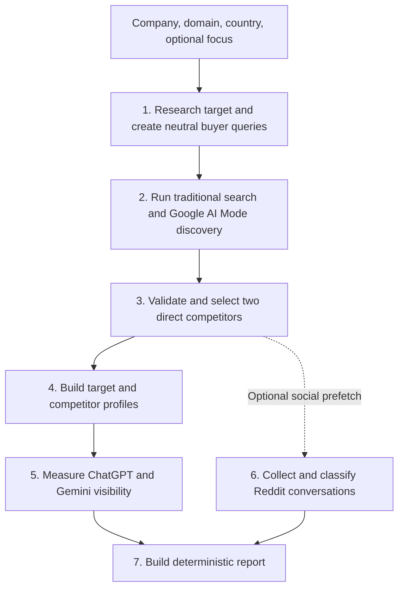

# Competitive Visibility Audit with Bright Data

[](https://colab.research.google.com/github/mhirschberg/competitive_vsibility_audit_bd/blob/main/competitive_visibility_audit_bd.ipynb)

Find out what traditional search and AI assistants show potential customers about a company - and how that visibility compares with two direct competitors.

The audit starts with neutral, non-branded questions. It does not put the company name into the buyer queries and then ask an AI to repeat it back. Instead, it asks the questions a real customer might ask about the product category and measures which companies appear naturally.

The result is a point-in-time comparison across:

- Google or Bing Search
- Google AI Mode
- ChatGPT
- Gemini
- Optional Reddit posts and comments

The notebook uses Bright Data for live collection and produces a downloadable Markdown report, styled PDF, structured JSON, and a ZIP containing the evidence and diagnostics.

No Python knowledge is required for the Google Colab workflow.

> This is a directional visibility audit, not a market-share measurement, scientific benchmark, or sentiment survey.

---

## Why this is useful

Traditional search results and AI answers do not necessarily present the same market.

A company may:

- Rank in search but remain absent from AI answers
- Appear in an AI answer despite weak measured search coverage
- Be visible through publisher, community, or professional sources rather than its own website
- Be described differently by different answer engines
- Have a strong public conversation that is not reflected in search rankings

The audit makes those differences visible without collapsing them into one artificial score.

---

## Quick start

You need:

1. A Google account with access to Google Colab.
2. A Bright Data account and API token.
3. An active Bright Data SERP API zone configured for Markdown output.
4. Access to the required Google AI Mode, ChatGPT, and Gemini datasets.
5. Reddit posts and comments dataset access only if Reddit analysis is enabled.

### 1. Open the notebook

[](https://colab.research.google.com/github/mhirschberg/competitive_vsibility_audit_bd/blob/main/competitive_visibility_audit_bd.ipynb)

### 2. Add the API token to Colab Secrets

Open the key icon in the Colab sidebar and add:

```text
BRIGHTDATA_API_TOKEN
```

Paste the token as the value and enable **Notebook access**. Do not paste credentials directly into the notebook.

### 3. Configure the audit

Use the form near the beginning of the notebook:

```python
COMPANY_NAME = "Your company or brand"
COMPANY_DOMAIN = "example.com"
AUDIT_FOCUS = ""

COUNTRY = "US"
SEARCH_ENGINE = "auto"
SERP_ZONE = "serp_api1"

AUTO_DOWNLOAD_REPORT = False
INCLUDE_REDDIT_ANALYSIS = False
DEBUG_MODE = False
```

| Field | Required | Description |
|---|---:|---|
| `COMPANY_NAME` | Yes | Company, product, brand, service, or organization to audit |
| `COMPANY_DOMAIN` | Yes | Official domain or website URL |
| `AUDIT_FOCUS` | No | Specific offering, category, audience, or customer need |
| `COUNTRY` | Yes | Two-letter country code used for localized search results |
| `SEARCH_ENGINE` | Yes | `auto`, `google`, `bing`, or `none` |
| `SERP_ZONE` | Yes | Bright Data SERP API zone name |
| `AUTO_DOWNLOAD_REPORT` | No | Download the ZIP automatically when the audit finishes |
| `INCLUDE_REDDIT_ANALYSIS` | No | Add competitive Reddit analysis; this increases runtime and request usage |
| `DEBUG_MODE` | No | Show snapshot, retry, prompt, parsing, and validation diagnostics |

The domain may be entered as `example.com`, `www.example.com`, or a complete URL. It is normalized automatically.

### 4. Run the notebook

Select:

```text
Runtime -> Run all
```

A core audit normally has six visible stages. Enabling Reddit adds a separate seventh-stage workflow:

```text
[1/7] Company analysis and buyer keywords
[2/7] Web Search and AI Mode competitor discovery
[3/7] Direct competitor selection
      Social discovery started in parallel
[4/7] Target and competitor profiles
[5/7] Cross-engine AI visibility
[6/7] Reddit conversation analysis
[7/7] Final report and export
```

The social collection starts as soon as the competitors are known, but it remains a clearly labelled stage and is reported separately from AI visibility.

A live audit can take several minutes. Reddit analysis may add up to 10 minutes depending on snapshot availability and retries.

---

## How it works



### 1. Research the target

Three Google AI Mode snapshots run concurrently. The first substantive result wins. Gemini and ChatGPT then race to structure the company research and generate eight non-branded buyer-intent searches.

### 2. Observe search and AI discovery

The notebook runs the eight buyer searches through Google or Bing and asks three neutral customer questions in Google AI Mode. Search requests run in parallel; each Google AI Mode question uses a three-snapshot race.

### 3. Validate competitors

Observed domains are combined with market research. Publishers, retailers, directories, distributors, and organizations at a different value-chain level are rejected before two direct substitutes are selected.

### 4. Build comparable profiles

The target and both competitors receive structured profiles using three-way Google AI Mode races. Failed profiles degrade to conservative fallback data rather than terminating the audit.

### 5. Compare AI visibility

The same neutral market need is evaluated in Google AI Mode, ChatGPT, and Gemini. The report keeps search coverage, answer coverage, mentions, first appearance, citations, and source types as separate signals.

### 6. Optionally examine Reddit

When enabled, Reddit discovery starts immediately after competitor selection and runs alongside the remaining audit. The target, both competitors, and the neutral category receive equivalent discovery treatment.

### 7. Build the report

Validated structured data is assembled deterministically. No additional AI request writes the final report, so a late formatting response cannot discard an otherwise successful audit.

For the full methodology, concurrency model, validation rules, and request-volume discussion, see [docs/METHODOLOGY.md](docs/METHODOLOGY.md).

---

## Audit focus

`AUDIT_FOCUS` is optional. Use it when an organization has multiple products, services, audiences, or markets.

Examples:

```python
COMPANY_NAME = "CeraVe"
COMPANY_DOMAIN = "cerave.com"
AUDIT_FOCUS = "facial moisturizer for dry and sensitive skin"
```

```python
COMPANY_NAME = "Rayner"
COMPANY_DOMAIN = "rayner.com"
AUDIT_FOCUS = "presbyopia-correcting intraocular lenses"
```

A focused audit generally produces more relevant buyer searches, competitor selection, profiles, comparisons, and recommendations.

If the focus is empty, the notebook infers the primary offering from public research. Generic placeholders such as `products and services` or `primary offering` are rejected before search requests are made.

---

## Optional Reddit analysis

Set:

```python
INCLUDE_REDDIT_ANALYSIS = True
```

The social stage compares four cohorts:

- Target company
- Competitor 1
- Competitor 2
- Neutral product category

With an explicit audit focus, the engine chooses one same-type comparison offering for each competitor. Without a focus, all brands are evaluated within the same inferred category.

Discovery combines:

- Native Reddit keyword discovery
- Google searches restricted to `reddit.com`
- Reddit URLs already found in the buyer-search results

The strongest early native query for each cohort uses three identical snapshots by default, with the first successful result retained. This reduces unpredictable slow-tail latency but increases request usage. Set `REDDIT_NATIVE_RACE_WIDTH=1` for lower usage at the cost of potentially longer waits.

Selected posts are hydrated, representative comments are collected, and Gemini and ChatGPT race to classify small validated batches. Failed batches are retried one thread at a time. Unclassified threads remain visible in diagnostics but are excluded from stance, theme, and experience counts.

The Reddit result is a selected conversation snapshot, not platform-wide sentiment measurement. Sample sizes and completeness warnings remain visible in the report.

---

## What the report contains

- Executive summary
- Competitive landscape
- Traditional-search visibility
- AI answer-engine visibility
- Source influence
- Reddit conversation snapshot when enabled
- Positioning and information gaps
- Prioritized recommendations
- Methodology and limitations
- Observed AI sources

The PDF includes a company-specific cover, optional focus label, formatted tables, clickable source links, page numbers, and print-friendly page breaks.

### Output files

Each run creates a timestamped directory:

```text
competitive-visibility-<name>-<timestamp>/
```

Typical contents:

```text
01_company_analysis.json
02_serp_results.json
03_competitor_selection.json
04_brand_profiles.json
05_ai_visibility.json
05_reddit_social.json
05_reddit_snapshot_manifest.json
06_competitive_visibility_audit.md
06_competitive_visibility_audit.pdf
06_competitive_visibility_audit.json
raw/
```

`05_reddit_social.json` records either the collected result or the disabled status. `05_reddit_snapshot_manifest.json` maps social snapshot IDs to their brand, operation, dataset, status, and race outcome.

The notebook also creates a ZIP archive containing the complete audit. Set `AUTO_DOWNLOAD_REPORT = True` to download it automatically.

---

## Understanding the main metrics

| Metric | Meaning | Important caveat |
|---|---|---|
| Search coverage | Searches in which the brand appeared | Not market share |
| Best rank | Highest observed organic position | One high rank can still mean narrow coverage |
| Average rank | Average position where the brand appeared | Undefined when the brand never appeared |
| Answer coverage | Measured AI answers containing the brand | Based only on the retained answer samples |
| Mention count | Non-overlapping references to known aliases | Sensitive to answer length and alias quality |
| First appearance | Character position of the first detected mention | Not a recommendation rank |
| Source influence | Types and domains cited by AI answers | Citation does not prove causation |

Unavailable values are displayed as an em dash rather than `NaN`; the corresponding JSON value is `null`.

---

## Bright Data products used

- SERP API for Google or Bing
- Google AI Mode dataset
- ChatGPT dataset
- Gemini dataset
- Reddit posts dataset when social analysis is enabled
- Reddit comments dataset when social analysis is enabled

Concurrent races reduce elapsed time and improve resilience, but every triggered snapshot may contribute to API usage, including snapshots that do not win a race.

---

## Local development

Create an uncommitted `.env.local` file in the repository root:

```text
BRIGHTDATA_API_TOKEN=...
SERP_ZONE=...
```

Create a virtual environment, install the requirements, and run:

```text
.venv/bin/python scripts/run_local_audit.py \
  --company "Rayner" \
  --domain "rayner.com" \
  --focus "presbyopia-correcting intraocular lenses" \
  --country "GB" \
  --include-reddit
```

Omit `--include-reddit` for the faster core audit. Use `--dry-run` to validate settings and the generated notebook runner without making Bright Data calls.

Live runs are written to timestamped directories under `local-runs/`, including `audit.log` and all report artifacts. `.env.local` and `local-runs/` are excluded from Git.

Run the regression suite with:

```text
.venv/bin/python -m unittest discover -s tests -q
```

---

## Limitations

- Buyer searches and competitor discovery are AI-assisted.
- Results vary by time, country, query, engine behavior, and snapshot availability.
- AI answers and citations can change between otherwise identical runs.
- The Reddit section is a selected sample and its classifications can be wrong.
- Profiles are public-research summaries, not verified product specifications.
- Mention detection depends on known names and aliases.
- Source classification is heuristic.
- The audit does not measure market share.
- Recommendations describe possible opportunities, not guaranteed outcomes.
- Medical, legal, financial, and regulated claims require independent review.

For recurring monitoring, reuse the same company, focus, country, and search-engine configuration across dates.

---

## Security

- Never commit a Bright Data API token.
- Store Colab credentials only in the `BRIGHTDATA_API_TOKEN` secret.
- Keep local credentials in the ignored `.env.local` file.
- Review generated reports before sharing them externally.
- Use the notebook only for permitted analysis of publicly accessible information.

---

## Troubleshooting

Common issues include missing secrets, inactive SERP zones, unavailable datasets, slow snapshots, partial Reddit samples, and rerunning notebook cells out of order.

See [docs/TROUBLESHOOTING.md](docs/TROUBLESHOOTING.md) for diagnostic steps and explanations of the generated manifest files.

---

## Repository structure

```text
competitive_vsibility_audit_bd/
├── competitive_visibility_audit_bd.ipynb  # primary Colab workflow
├── app.py                                  # optional web wrapper
├── reddit_social.py                        # social collection and analysis
├── scripts/
│   ├── embed_reddit_social.py
│   ├── rerun_reddit_stage.py
│   └── run_local_audit.py
├── tests/                                  # regression suite
├── docs/
│   ├── METHODOLOGY.md
│   └── TROUBLESHOOTING.md
├── requirements.txt
└── README.md
```

---

## Project status

This is a working reference implementation and workshop tool.

It is not an official Bright Data SLA, benchmark, ranking system, or production monitoring product. Review request cost, retry behavior, data retention, and compliance requirements before adapting it for production use.

The original staged competitive-audit concept was inspired by [ScrapeAlchemist/Competitive-Visibility-Audit](https://github.com/ScrapeAlchemist/Competitive-Visibility-Audit). This implementation was rebuilt as a category-neutral Google Colab workflow using Bright Data for live traditional-search, AI-answer, and optional Reddit collection.
