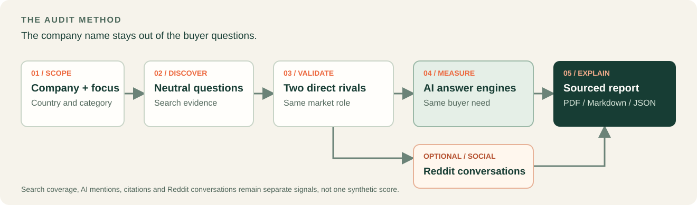
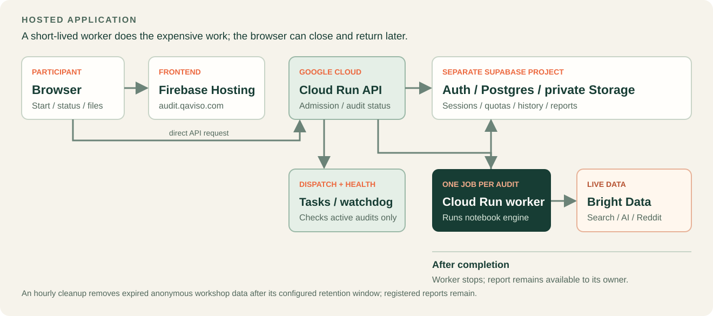

# Competitive Visibility Audit

[](https://colab.research.google.com/github/mhirschberg/competitive_vsibility_audit_bd/blob/main/competitive_visibility_audit_bd.ipynb)

**What do buyers actually see when they ask about your product category — without mentioning your brand?**

This project turns that question into a live, evidence-backed comparison of a company and two direct competitors. It generates brand-free buyer questions, observes traditional search and AI answers, optionally samples Reddit conversations, and produces a downloadable report. The company name is **not** planted in the buyer questions. The questions are informed by the target's category, audit focus, and public product features, so this is a target-centered audit rather than a perfectly feature-neutral market benchmark.



The result is a point-in-time comparison across:

- Google or Bing Search
- Google AI Mode
- ChatGPT
- Gemini
- Microsoft Copilot (optional)
- Optional Reddit posts and comments

Bright Data supplies the live search, AI-answer and optional Reddit datasets. The engine produces a styled PDF, Markdown, structured JSON and a ZIP with evidence and diagnostics. The report keeps search coverage, answer coverage, citations and social conversations separate; it does not manufacture a single visibility score.

## Choose how to try it

| Route | Best for | What you need |
|---|---|---|
| [Hosted web app](https://audit.qaviso.com) | Trying an audit without setup | Google sign-in for the limited personal trial, or a workshop link supplied by an organizer |
| [Google Colab notebook](https://colab.research.google.com/github/mhirschberg/competitive_vsibility_audit_bd/blob/main/competitive_visibility_audit_bd.ipynb) | Running your own audits and inspecting the code | A Bright Data account, API token, SERP API zone and access to the selected datasets |

The hosted app uses project-owned infrastructure and finite workshop/trial quotas. The notebook runs under your own Bright Data account. No Python knowledge is required for the Colab form, but you control its credentials and usage.

In the hosted app, you can include or skip each AI answer source and choose a longer wait for it. ChatGPT, Gemini, and Copilot are on by default; Google AI Mode is off by default because its measured answers have recently been unreliable. This choice affects report measurements, not the internal ChatGPT/Gemini research that helps construct the audit. A longer wait may increase runtime and cost but cannot guarantee an answer.

> This is a directional visibility audit, not a market-share measurement, scientific benchmark, or sentiment survey.

---

## Why this is useful

Traditional search results and AI answers do not necessarily present the same market.

A company may:

- Rank in search but remain absent from AI answers
- Appear in an AI answer despite weak measured search coverage
- Be visible through publisher, community, or professional sources rather than its own website
- Be described differently by different answer engines
- Have a strong public conversation that is not reflected in search rankings

The audit makes those differences visible without collapsing them into one artificial score.

---

## Run the notebook yourself

You need:

1. A Google account with access to Google Colab.
2. A Bright Data account and API token.
3. An active Bright Data SERP API zone configured for Markdown output. Google uses parsed organic JSON; Bing fallback uses the zone's raw Markdown output.
4. Access to the ChatGPT and Gemini datasets. Google AI Mode is measured when available; its failure is reported as unavailable rather than stopping the audit. Copilot dataset access is needed when that channel is enabled.
5. Reddit posts dataset access if Reddit analysis is enabled; Reddit comments dataset access only if you also choose comment collection.

### 1. Open the notebook

[](https://colab.research.google.com/github/mhirschberg/competitive_vsibility_audit_bd/blob/main/competitive_visibility_audit_bd.ipynb)

### 2. Add the API token to Colab Secrets

Open the key icon in the Colab sidebar and add:

```text
BRIGHTDATA_API_TOKEN
```

Paste the token as the value and enable **Notebook access**. Do not paste credentials directly into the notebook.

### 3. Configure the audit

Use the form near the beginning of the notebook:

```python
COMPANY_NAME = "Your company or brand"
COMPANY_DOMAIN = "example.com"
AUDIT_FOCUS = ""

COUNTRY = "US"
SEARCH_ENGINE = "auto"
SERP_ZONE = "serp_api1"

AUTO_DOWNLOAD_REPORT = False
INCLUDE_REDDIT_ANALYSIS = False
REDDIT_COMMENT_POSTS_PER_COHORT = 0
INCLUDE_COPILOT_VISIBILITY = True
WAIT_LONGER_FOR_GOOGLE_AI_MODE = False
CONTINUE_LAST_AUDIT = False
RECOVERY_SNAPSHOT_IDS = ""
DEBUG_MODE = False
```

| Field | Required | Description |
|---|---:|---|
| `COMPANY_NAME` | Yes | Company, product, brand, service, or organization to audit |
| `COMPANY_DOMAIN` | Yes | Official domain or website URL |
| `AUDIT_FOCUS` | No | Specific offering, category, audience, or customer need |
| `COUNTRY` | Yes | Two-letter country code used for localized search results |
| `SEARCH_ENGINE` | Yes | `auto`, `google`, `bing`, or `none`. `auto` selects one available engine for the search batch and may use Bing; the report names the engine actually measured and never mixes rankings across engines |
| `SERP_ZONE` | Yes | Bright Data SERP API zone name |
| `AUTO_DOWNLOAD_REPORT` | No | Download the ZIP automatically when the audit finishes |
| `INCLUDE_REDDIT_ANALYSIS` | No | Add competitive Reddit post analysis; this increases runtime and request usage |
| `REDDIT_COMMENT_POSTS_PER_COHORT` | No | Number of posts per Reddit group sent for separate comment collection: `0` (default/off), `1`, `2`, `5`, or `10` |
| `INCLUDE_COPILOT_VISIBILITY` | No | Add one public-web Copilot answer as a fourth AI visibility channel; timeout/failure does not fail the audit |
| `WAIT_LONGER_FOR_GOOGLE_AI_MODE` | No | Extend the Google AI Mode buyer-answer health check; otherwise it gives up after 120 seconds and reports that engine unavailable |
| `CONTINUE_LAST_AUDIT` | No | Continue the latest incomplete audit for this company from its saved steps 1–2, reusing saved AI research snapshots |
| `RECOVERY_SNAPSHOT_IDS` | No | Space-separated snapshot IDs from a run made before snapshot caching was added; leave blank for new runs |
| `DEBUG_MODE` | No | Show snapshot, retry, prompt, parsing, and validation diagnostics |

The domain may be entered as `example.com`, `www.example.com`, or a complete URL. It is normalized automatically.

### 4. Run the notebook

Select:

```text
Runtime -> Run all
```

A core audit normally has six visible stages. Enabling Reddit adds a separate seventh-stage workflow:

```text
[1/7] Company analysis and buyer keywords
[2/7] Web Search and Google AI Mode measurement
[3/7] Direct competitor selection
      Social discovery started in parallel
[4/7] Target and competitor profiles
[5/7] Cross-engine AI visibility
[6/7] Reddit conversation analysis
[7/7] Final report and export
```

The social collection starts as soon as the competitors are known, but it remains a clearly labelled stage and is reported separately from AI visibility.

A live audit can take several minutes. Reddit analysis may add up to 10 minutes depending on snapshot availability and retries. Comment collection is **off by default** even when Reddit post analysis is enabled.

### Continue after an interrupted audit

The notebook saves AI research snapshot IDs as soon as they are triggered. If an audit stops after stage 2, keep the same Colab runtime open, enable `CONTINUE_LAST_AUDIT` in the configuration form, and rerun the configuration and audit cells. It reuses the company analysis, search results, and already-triggered snapshots, including Google AI Mode snapshots from older runs. During resumed competitor selection it does **not** launch replacement snapshots for candidates without saved IDs; it marks those candidates unvalidated instead. Later stages still make the requests needed to finish the report.

On failure, the notebook creates a recovery ZIP in `/content`. Download it before disconnecting if you may lose the Colab runtime. In a new runtime, upload that ZIP to `/content`, use the same audit settings, enable `CONTINUE_LAST_AUDIT`, and run the notebook. The ZIP contains audit inputs and results; treat it as private. For runs made before this feature, paste the snapshot IDs from the old log into `RECOVERY_SNAPSHOT_IDS` so they can be matched to their original prompts without re-triggering them. If no matching checkpoint is present, continuation stops rather than starting a new paid audit.

---

## How it works

The [pipeline diagram](docs/assets/audit-pipeline.svg) shows the decision order. Reddit discovery can start once the competitors are known and runs alongside later AI measurement; it is not part of the AI-answer score.

### 1. Research the target

ChatGPT and Gemini each receive one target-research request. The first substantive, task-valid result wins; both snapshot IDs and the winning provider are saved. Gemini and ChatGPT then race to structure the research and generate eight non-branded buyer-intent searches.

### 2. Observe search and AI discovery

The notebook runs the eight buyer searches through Google or Bing. If one search fails, the other successful results still count: the report marks coverage as partial (for example, 7/8) and excludes the missing query from brand-visibility ratios. It never mixes Google and Bing rankings. The notebook also tests one brand-free customer question in Google AI Mode with a bounded wait. If Google AI Mode is unavailable, the other two questions are skipped and its visibility is reported as unavailable, while the audit continues. If it responds, all three Google AI Mode questions are measured as before.

### 3. Validate competitors

Observed domains are combined with a first-valid ChatGPT/Gemini market-research race. Each candidate is checked through the same two-provider race against the locked target scope. Publishers, retailers, directories, distributors, and organizations at a different value-chain level are rejected before two direct substitutes are selected.

### 4. Build comparable profiles

The target and both competitors receive structured profiles using first-valid ChatGPT/Gemini research races. Failed profiles degrade to conservative fallback data rather than terminating the audit.

### 5. Compare AI visibility

The same brand-free, target-informed market need is evaluated independently in Google AI Mode, ChatGPT, Gemini, and (when enabled) public-web Copilot. Copilot uses one snapshot with a three-minute wait; if it is unavailable, its visibility is not scored and the audit continues. Research answers never stand in for a measured engine's buyer-facing answer. The report keeps search coverage, answer coverage, mentions, first appearance, citations, and source types as separate signals.

### 6. Optionally examine Reddit

When enabled, Reddit discovery starts immediately after competitor selection and runs alongside the remaining audit. The target, both competitors, and the neutral category receive equivalent discovery treatment. Separate comment scraping remains off unless the user selects a nonzero comment-post setting.

### 7. Build the report

Validated structured data is assembled deterministically. No additional AI request writes the final report, so a late formatting response cannot discard an otherwise successful audit.

For the full methodology, concurrency model, validation rules, and request-volume discussion, see [docs/METHODOLOGY.md](docs/METHODOLOGY.md).

## Hosted architecture



The browser loads the participant UI from Firebase Hosting and signs in through Supabase Auth. It sends an audit request to the Cloud Run API, which checks the applicable trial or workshop quota and records an idempotent request in Supabase Postgres. The API dispatches one Cloud Run worker job for that audit. The worker runs the same notebook engine, collects live data through Bright Data, writes stage updates to the database and saves reports in private Supabase Storage. The browser can be closed; on return, the signed-in user retrieves the audit and its files from their history.

Cloud Tasks and a private watchdog check only active audits and stop when each audit reaches a terminal state. An hourly cleanup removes anonymous workshop data after the organizer's retention window; registered users and their reports are not part of that anonymous purge. The organizer panel controls workshop admission and concurrency caps. These limits constrain **how many audits start**, not the exact number of Bright Data records an individual audit may return. See [hosted deployment details](docs/HOSTED_BACKEND.md), [database and access model](docs/SUPABASE_DATABASE.md), and [cost visibility](docs/COSTS_AND_WAKEUP.md).

---

## Audit focus

`AUDIT_FOCUS` is optional. Use it when an organization has multiple products, services, audiences, or markets.

Examples:

```python
COMPANY_NAME = "CeraVe"
COMPANY_DOMAIN = "cerave.com"
AUDIT_FOCUS = "facial moisturizer for dry and sensitive skin"
```

```python
COMPANY_NAME = "Rayner"
COMPANY_DOMAIN = "rayner.com"
AUDIT_FOCUS = "presbyopia-correcting intraocular lenses"
```

A focused audit generally produces more relevant buyer searches, competitor selection, profiles, comparisons, and recommendations.

If the focus is empty, the notebook infers the primary offering from public research. Generic placeholders such as `products and services` or `primary offering` are rejected before search requests are made.

---

## Optional Reddit analysis

Set:

```python
INCLUDE_REDDIT_ANALYSIS = True
REDDIT_COMMENT_POSTS_PER_COHORT = 0  # default: classify posts, skip separate comment scraping
```

The social stage compares four cohorts:

- Target company
- Competitor 1
- Competitor 2
- Neutral product category

With a category-level audit focus, all brands are evaluated within that same category. With a specific product or service focus, the engine chooses a comparable same-type offering for each competitor. Without a focus, all brands use the same inferred category.

Reddit discovery does **not** copy the target's buyer-intent keywords into competitor searches. For a category-level focus such as `premium smartphone`, every brand uses the same template: `<brand> premium smartphone`, `<brand> premium smartphone review`, and `<brand> review`. The separate neutral cohort searches the category without a brand. For a specific offering, the target can use its named product while early competitor discovery uses the broader category when available; later comparison uses validated comparable offerings.

Discovery combines:

- Native Reddit keyword discovery
- Google searches restricted to `reddit.com`
- Reddit URLs already found in the buyer-search results

The strongest early native query for each cohort uses three identical snapshots by default, with the first successful result retained. This reduces unpredictable slow-tail latency but increases request usage. Set `REDDIT_NATIVE_RACE_WIDTH=1` for lower usage at the cost of potentially longer waits.

Selected posts are hydrated, and Gemini and ChatGPT race to classify small validated batches. Failed batches are retried one thread at a time. Unclassified threads remain visible in diagnostics but are excluded from stance, theme, and experience counts.

**Comment collection is a separate, optional cost choice.** The default `0` analyses post titles and bodies without calling the comments dataset. Choose `1`, `2`, `5`, or `10` to send up to that many selected posts **per cohort** for comment collection (up to four cohorts). At most three representative comments per scraped post are retained for classification and the report. That retention limit is **not** a billing limit: Bright Data can return many more comment records for a busy post. The published comments input supports a `days_back` filter but does not document a maximum comment count per post, so even a one-post setting cannot guarantee a dollar ceiling. [Bright Data's Reddit scraper reference](https://docs.brightdata.com/cn/api-reference/scrapers/social-media-apis/reddit) describes the available inputs.

The Reddit result is a selected conversation snapshot, not platform-wide sentiment measurement. Sample sizes and completeness warnings remain visible in the report.

---

## What the report contains

- Executive summary
- Competitive landscape
- Traditional-search visibility
- AI answer-engine visibility
- Source influence
- Reddit conversation snapshot when enabled
- Positioning and information gaps
- Prioritized recommendations
- Methodology and limitations
- Observed AI sources

The PDF includes a company-specific cover, optional focus label, formatted tables, clickable source links, page numbers, and print-friendly page breaks.

### Output files

Each run creates a timestamped directory:

```text
competitive-visibility-<name>-<timestamp>/
```

Typical contents:

```text
00_run_settings.json
01_company_analysis.json
02_serp_results.json
03_competitor_selection.json
04_brand_profiles.json
05_ai_visibility.json
05_reddit_social.json
05_reddit_snapshot_manifest.json
06_bright_data_usage.json
06_competitive_visibility_audit.md
06_competitive_visibility_audit.pdf
06_competitive_visibility_audit.json
raw/
```

`05_reddit_social.json` records either the collected result or the disabled status. `05_reddit_snapshot_manifest.json` maps social snapshot IDs to their brand, operation, dataset, status, and race outcome.

The notebook also creates a ZIP archive containing the complete audit. Set `AUTO_DOWNLOAD_REPORT = True` to download it automatically.

---

## Understanding the main metrics

| Metric | Meaning | Important caveat |
|---|---|---|
| Search coverage | Searches in which the brand appeared | Not market share |
| Best rank | Highest observed organic position | One high rank can still mean narrow coverage |
| Average rank | Average position where the brand appeared | Undefined when the brand never appeared |
| Answer coverage | Measured AI answers containing the brand | Based only on the retained answer samples |
| Mention count | Non-overlapping references to known aliases | Sensitive to answer length and alias quality |
| First appearance | Character position of the first detected mention | Not a recommendation rank |
| Source influence | Types and domains cited by AI answers | Citation does not prove causation |

Unavailable values are displayed as an em dash rather than `NaN`; the corresponding JSON value is `null`.

---

## Bright Data products used

- SERP API for Google or Bing
- Google AI Mode dataset
- ChatGPT dataset
- Gemini dataset
- Microsoft Copilot dataset when that channel is enabled
- Reddit posts dataset when social analysis is enabled
- Reddit comments dataset only when comment collection is selected

Concurrent races reduce elapsed time and improve resilience, but every triggered snapshot may contribute to API usage, including snapshots that do not win a race.
If the first Google AI Mode buyer question fails its short health check, the audit does not launch the other two questions. The already-triggered IDs remain saved. A one- or two-answer sample is marked partial and excluded from comparative visibility and source counts; it must not be interpreted as absence. The hosted “Wait longer” option deliberately raises the Google AI Mode wait, but a Cloud Run job still has a finite deadline. Automatic resume from a killed worker is not yet implemented.

### Usage and cost

The report includes Bright Data operations, confirmed result records, and a **cost estimate**, not an invoice. The current estimate assumes **$1.50 per 1,000 returned result records**; a different Bright Data contract may have a different rate. Result records matter more than request count: one Reddit comment-dataset input can return hundreds of comments. The audit also records losing but accepted research-race requests. Check the Bright Data dashboard for actual billing and dataset-specific prices.

For scale, a September 2026 Apple research run with the old full-comment behavior returned 1,150 confirmed records, including 1,018 Reddit records and 802 comments. That run also included debugging and reclassification, so it is **not** a typical per-audit price. It demonstrates why the new comment setting defaults to off. The hosted workshop/trial quotas bound admission, but this setting only limits how many posts are sent to the comments dataset; it cannot guarantee a fixed spend when comments are enabled.

For the hosted app's report-ready email design and current verification status, see [Report-ready email notifications](docs/EMAIL_NOTIFICATIONS.md).

---

## Local development

Create an uncommitted `.env.local` file in the repository root:

```text
BRIGHTDATA_API_TOKEN=...
SERP_ZONE=...
```

Create a virtual environment, install the requirements, and run:

```text
.venv/bin/python scripts/run_local_audit.py \
  --company "Rayner" \
  --domain "rayner.com" \
  --focus "presbyopia-correcting intraocular lenses" \
  --country "GB" \
  --include-reddit \
  --reddit-comment-posts-per-cohort 0
```

Omit `--include-reddit` for the faster core audit. Set `--reddit-comment-posts-per-cohort` to a value from 1 to 10 only if you want the additional comment dataset calls. Use `--dry-run` to validate settings and the generated notebook runner without making Bright Data calls.

Live runs are written to timestamped directories under `local-runs/`, including `audit.log` and all report artifacts. `.env.local` and `local-runs/` are excluded from Git.

Run the regression suite with:

```text
.venv/bin/python -m unittest discover -s tests -q
```

---

## Limitations

- Buyer searches and competitor discovery are AI-assisted.
- Results vary by time, country, query, engine behavior, and snapshot availability.
- AI answers and citations can change between otherwise identical runs.
- The Reddit section is a selected sample and its classifications can be wrong.
- Profiles are public-research summaries, not verified product specifications.
- Mention detection depends on known names and aliases.
- Source classification is heuristic.
- The audit does not measure market share.
- Recommendations describe possible opportunities, not guaranteed outcomes.
- Medical, legal, financial, and regulated claims require independent review.

For recurring monitoring, reuse the same company, focus, country, and search-engine configuration across dates.

---

## Security

- Never commit a Bright Data API token.
- Store Colab credentials only in the `BRIGHTDATA_API_TOKEN` secret.
- Keep local credentials in the ignored `.env.local` file.
- Review generated reports before sharing them externally.
- Use the notebook only for permitted analysis of publicly accessible information.

---

## Troubleshooting

Common issues include missing secrets, inactive SERP zones, unavailable datasets, slow snapshots, partial Reddit samples, and rerunning notebook cells out of order.

See [docs/TROUBLESHOOTING.md](docs/TROUBLESHOOTING.md) for diagnostic steps and explanations of the generated manifest files.

---

## Repository structure

```text
competitive_vsibility_audit_bd/
├── competitive_visibility_audit_bd.ipynb  # standalone Colab workflow
├── app.py                                  # optional web wrapper
├── runner_builder.py                       # lightweight hosted runner builder
├── audit_core/                             # shared service/notebook logic (migration underway)
├── notebook_builder.py                     # deterministic notebook cell assembly
├── hosted/                                 # deployed API, worker and watchdog code
├── web/                                    # hosted participant and organizer UI
├── supabase/migrations/                    # versioned hosted database schema
├── reddit_social.py                        # social collection and analysis
├── scripts/
│   ├── embed_reddit_social.py
│   ├── build_notebook.py
│   ├── rerun_reddit_stage.py
│   └── run_local_audit.py
├── tests/                                  # regression suite
├── docs/
│   ├── METHODOLOGY.md
│   ├── HOSTED_BACKEND.md
│   ├── SUPABASE_DATABASE.md
│   ├── TROUBLESHOOTING.md
│   └── assets/                             # GitHub-rendered architecture diagrams
├── requirements.txt
└── README.md
```

The service-first refactor is in progress. For code already extracted into
Python sources, refresh the checked-in notebook with
`python scripts/build_notebook.py --write` and verify it with
`python scripts/build_notebook.py --check`. The notebook remains self-contained;
the hosted audit still runs the notebook engine until stage-by-stage parity is
established. See [the migration plan](docs/SERVICE_FIRST_NOTEBOOK_PLAN.md).

---

## Project status

This is a working reference implementation and workshop tool. A separate hosted deployment is live at [audit.qaviso.com](https://audit.qaviso.com), with Supabase-backed history and per-audit Cloud Run workers. The notebook remains available for people who want to run it on their own Bright Data account. Repository changes do not reach the hosted service until a separate deployment; consult [docs/HOSTED_BACKEND.md](docs/HOSTED_BACKEND.md) for the deployed architecture and operational caveats.

It is not an official Bright Data SLA, benchmark, ranking system, or production monitoring product. Review request cost, retry behavior, data retention, and compliance requirements before adapting it for production use.

The original staged competitive-audit concept was inspired by [ScrapeAlchemist/Competitive-Visibility-Audit](https://github.com/ScrapeAlchemist/Competitive-Visibility-Audit). This implementation was rebuilt as a brand-free, category-focused Google Colab workflow using Bright Data for live traditional-search, AI-answer, and optional Reddit collection.
