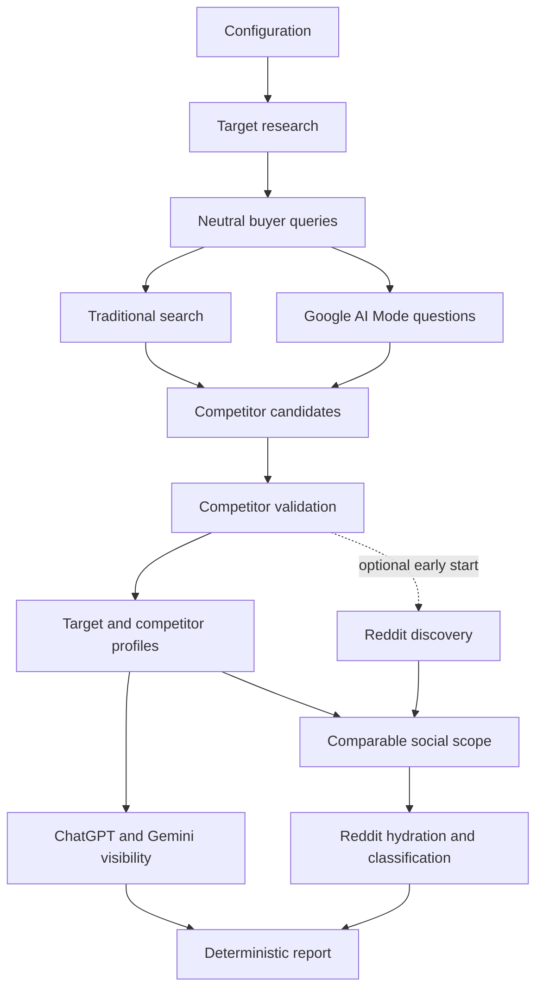

# Methodology and Architecture

This document describes the technical workflow behind the Competitive Visibility Audit. For setup and the shorter project overview, see the [README](../README.md).

## Measurement principle

The audit asks neutral questions about a product category or customer need without naming the audited company or its competitors.

This distinction is fundamental. A prompt such as "What are the best options for this need?" measures whether a brand appears naturally. A prompt that contains the brand name measures how an engine describes a brand it was already instructed to discuss.

The audit keeps several signals separate:

- Traditional-search visibility
- AI answer coverage
- Brand mentions and first appearance
- Cited source domains and source types
- Optional public Reddit conversation

It does not combine them into a synthetic market-share or reputation score.

## Pipeline overview

The core audit has six visible stages. When Reddit is enabled, social analysis becomes Stage 6 and final reporting becomes Stage 7.

## Stage 1: Target research and buyer queries

Three Google AI Mode snapshots research the target concurrently. A result wins only if it contains substantive content rather than an empty response, interface boilerplate, or another unusable payload.

The research may cover:

- Market category
- Products or services
- Positioning
- Primary customers
- Benefits and capabilities
- Claims and attributes
- Differentiators
- Public evidence
- Comparison criteria

Gemini and ChatGPT then run concurrently to structure the research. The first response that satisfies the expected JSON schema is retained.

The structured result contains eight non-branded buyer-intent queries. Generic placeholders such as `products and services` and `primary offering` are rejected. If keyword completion is required, Gemini and ChatGPT race again.

The optional audit focus narrows the purchase decision used throughout the audit. Without a focus, the engine infers the target's primary offering from public research.

## Stage 2: Traditional search and Google AI Mode

### Traditional search

The eight buyer queries run in parallel through Bright Data SERP API.

`SEARCH_ENGINE = "auto"` tries Google first and falls back to Bing if Google remains unavailable. A single audit uses one coherent traditional search engine rather than mixing rankings from different engines.

Available settings:

- `auto`: try Google, then fall back to Bing
- `google`: use Google only
- `bing`: use Bing only
- `none`: continue without traditional-search measurement

For each audited brand, the engine records:

- Search coverage
- Best observed organic position
- Average observed organic position
- Queries in which the domain appeared

Coverage is the primary signal. Best and average position describe placement only when a brand appears. If search is disabled or unavailable, the report marks it as not measured rather than assigning zero visibility.

### Google AI Mode questions

Three neutral customer questions are asked without naming the audited brands. Each question starts three Google AI Mode snapshots and retains the first substantive response.

The retained results provide:

- Answer text
- Brand mentions
- Citations
- Source URLs and domains
- Citation order

Google `/goto` citation links are resolved when possible. Expired or unresolved opaque redirects may be omitted from source analysis.

## Stage 3: Competitor discovery and validation

Traditional-search domains and recurring Google AI Mode source domains become observed candidates. Three additional Google AI Mode snapshots research the market and propose up to ten likely competitors.

A valid direct competitor must:

1. Sell, manufacture, operate, or provide its own offering.
2. Serve substantially the same primary buyer.
3. Operate at substantially the same value-chain level.
4. Offer a substitute within the same purchase decision.
5. Be something a customer would realistically compare with the target.

The validator rejects publishers, review sites, directories, retailers, marketplaces, distributors, resellers, forums, government organizations, educational resources, and suppliers without a substitutable offering.

The first two candidates that pass the required checks are selected. If structured validation fails, the audit may fall back to conservative observed candidates and records that fallback in its diagnostics.

When Reddit analysis is enabled, social discovery starts immediately after these competitors are known.

## Stage 4: Comparable profiles

The engine creates profiles for:

- Target company
- Competitor 1
- Competitor 2

Each profile uses a three-way Google AI Mode race with structured validation. Depending on the market, fields may describe offerings, customer segments, benefits, features, claims, materials, specifications, use cases, pricing, availability, positioning, differentiators, and public evidence.

A failed profile does not terminate the complete audit. Conservative fallback data is used where possible. Fallback profiles preserve the identity and scope of the corresponding competitor rather than inheriting the target's product name.

## Stage 5: Cross-engine AI visibility

The target and selected competitors are measured in:

- Google AI Mode
- ChatGPT
- Gemini

Google AI Mode visibility is calculated from the successful neutral customer-question answers retained during Stage 2.

ChatGPT and Gemini each start three snapshots. The two engine races run concurrently, and the first valid response from each engine is retained.

The audit records:

- Answer coverage
- Brand mentions
- Non-overlapping mention counts
- First appearance among the audited brands
- Citations and source URLs
- Source classifications
- Whether ChatGPT reported using web search

Conservative aliases reduce false positives from common words or overlapping product names.

## Optional Stage 6: Reddit conversation analysis

The social branch is optional because it increases runtime and request usage.

### Comparable cohorts

Four cohorts receive equivalent treatment:

1. Target company
2. Competitor 1
3. Competitor 2
4. Neutral category

When an explicit audit focus is supplied, one same-type comparison offering is chosen for each competitor. When no focus is supplied, the same inferred category is applied to all three brands.

This prevents an audit of a specific product type from silently comparing one company's product with another company's entire portfolio or with an unrelated item.

### Discovery

Three discovery paths are combined:

- Native Reddit keyword discovery
- Google searches restricted to `reddit.com`
- Reddit URLs already present in the buyer-search results

For each cohort, the strongest early native query uses `REDDIT_NATIVE_RACE_WIDTH` identical snapshots. The default width is three. The first successful snapshot wins, while the wider query set continues through site-restricted search discovery.

Results are deduplicated by Reddit post ID. The strongest candidates are hydrated through the Reddit posts dataset. Selection limits community concentration during the first pass so one subreddit does not dominate the sample.

Representative comments are collected for context. Native discovery and comment collection use a one-year lookback by default.

### Classification

Selected threads are classified in small batches. Gemini and ChatGPT race on each batch.

A valid classification response must:

- Return the complete expected schema
- Cover every supplied thread
- Use evidence excerpts that occur verbatim in the supplied thread text
- Preserve the distinction between relevant, irrelevant, and unclassified material

Failed batches are retried one thread at a time. Threads that still cannot be classified remain visible as unclassified and do not contribute to relevance, stance, theme, pain-point, desired-outcome, or experience counts.

Aggregation after classification is deterministic.

### Partial completion

Failure of one discovery path, hydration call, comment collection, or classifier does not terminate the complete audit. Remaining evidence is retained.

The report displays a concise completeness warning. Detailed causes remain in:

- `05_reddit_social.json`
- `05_reddit_snapshot_manifest.json`

The manifest maps every recorded social snapshot to its brand or category, operation, dataset, status, and race outcome.

## Final reporting

The final report is assembled deterministically from validated structured data. No answer engine is asked to rewrite the complete report at the end of the run.

This design prevents a late formatting failure from discarding a successful collection run and makes repeated output easier to compare.

The final artifacts include:

- Markdown report
- Styled PDF
- Structured JSON
- Complete ZIP archive
- Intermediate stage JSON
- Raw retained records and diagnostics

## Concurrency and validation

Concurrency serves two different purposes:

1. Independent work runs in parallel to reduce elapsed time.
2. Identical or equivalent requests race to reduce unpredictable long-tail snapshot latency.

A completed request does not automatically win. Each race accepts the first response that passes task-specific validation. Losing snapshots are no longer polled after a winner has been selected, although every triggered request may still contribute to usage.

Examples of rejected responses include:

- Empty content
- Interface or consent boilerplate
- Unparseable JSON
- Missing required fields
- Generic competitor or product placeholders
- Incomplete classification batches
- Unsupported profile identity or scope

## Approximate request volume

A successful core audit may trigger:

- 3 Google AI Mode target-research snapshots
- 1 Gemini and 1 ChatGPT structuring request
- Up to 8 Google or Bing searches, plus a health check and retries
- 9 Google AI Mode question snapshots: 3 questions by 3 snapshots
- 3 Google AI Mode competitor-research snapshots
- 9 Google AI Mode profile snapshots: 3 brands by 3 snapshots
- 3 ChatGPT visibility snapshots
- 3 Gemini visibility snapshots

Additional requests may occur for keyword completion, strict-format recovery, retries, or snapshot recovery.

With Reddit enabled, the audit may also trigger:

- Up to 12 native discovery snapshots by default: 4 cohorts by a race width of 3
- Site-restricted Reddit searches for the wider cohort query sets
- Reddit post hydration and representative comment collection
- Gemini and ChatGPT classification requests for each batch
- Per-thread classification retries for failed batches

Exact usage depends on availability, retries, generated queries, selected samples, and validation outcomes. Set `REDDIT_NATIVE_RACE_WIDTH=1` to reduce native discovery usage.

## Interpretation limits

The audit is a directional snapshot, not a statistically significant measurement.

- Search results vary by time, country, query, and engine behavior.
- AI answers can vary between identical requests.
- Citation presence does not establish why a brand was included or excluded.
- First appearance is not a formal recommendation rank.
- Reddit samples are selected evidence, not platform-wide sentiment.
- AI-assisted labels and competitor choices can be wrong.
- Public profiles are not verified product specifications.
- The audit does not measure market share.
- Regulated claims require independent review.

For longitudinal comparison, keep the company, domain, focus, country, and search-engine selection consistent across runs.
